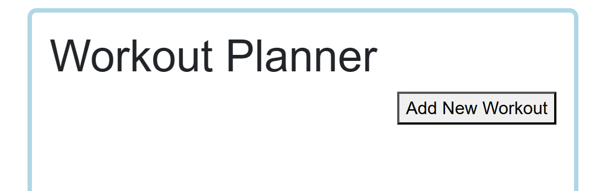
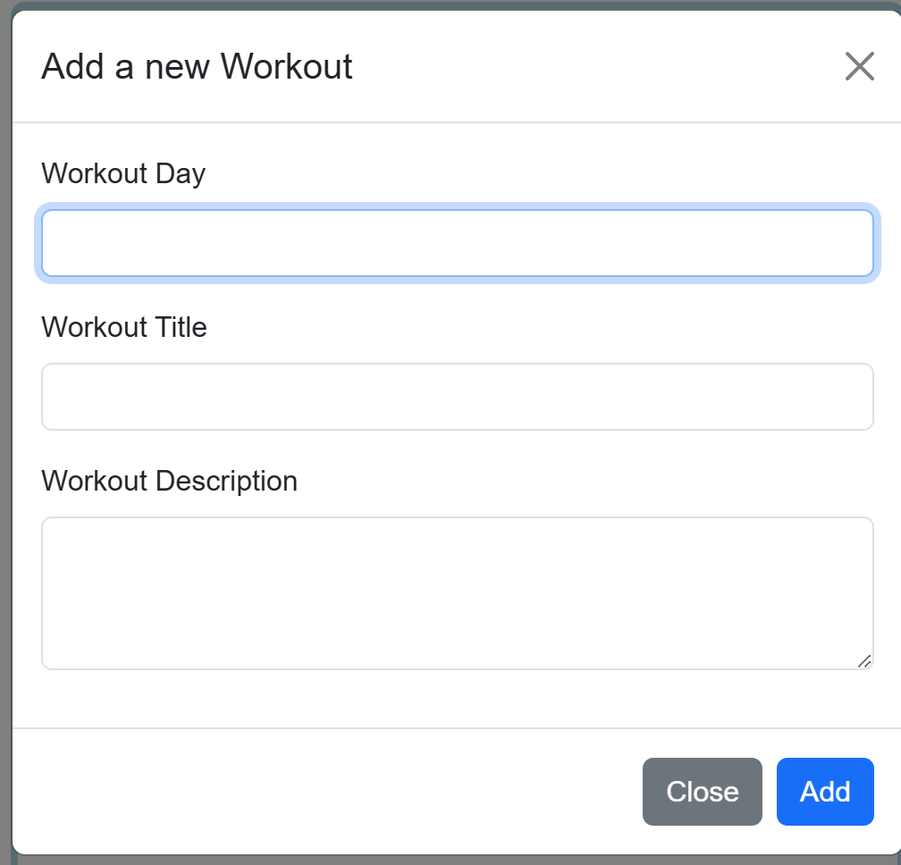
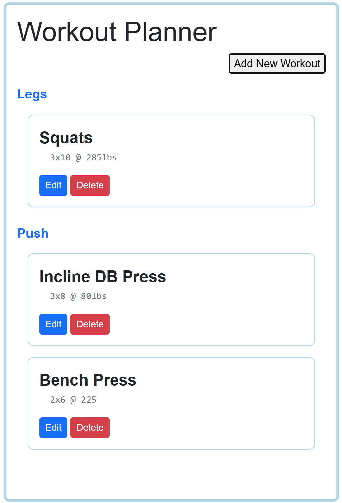

# WorkoutApp
<b>CS:3980 Midterm Project</b>

Create virtual environment: py -m venv venv

Activate virtual environment: venv\Scripts\activate or  .\venv\Scripts\Activate.ps1

Run App with: uvicorn main:app --reload

___

The purpose of this app is to create a workout planner where you can create different workout days and add specific workouts to those days.

___

The workout planner starts off with an empty screen, allowing the user to Add New Workout:

Adding a new workout is very similar to adding a todo in the TodoApp in class:

Once you add multiple workouts, they group together to create a visually pleasing workout planner:

